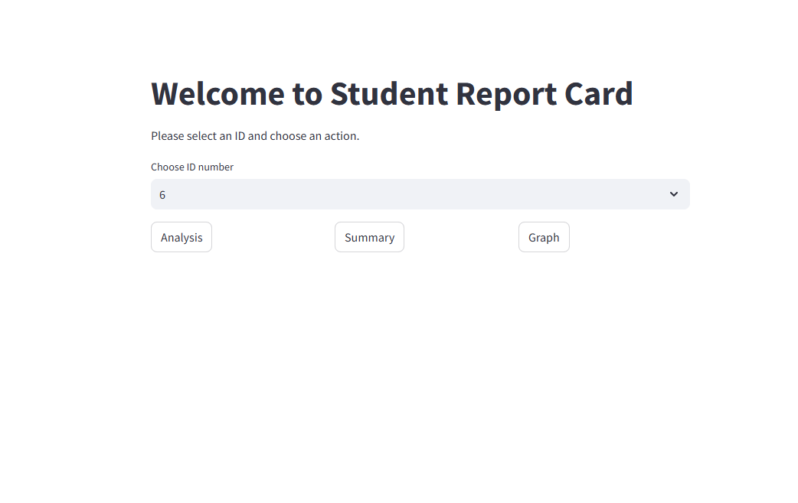
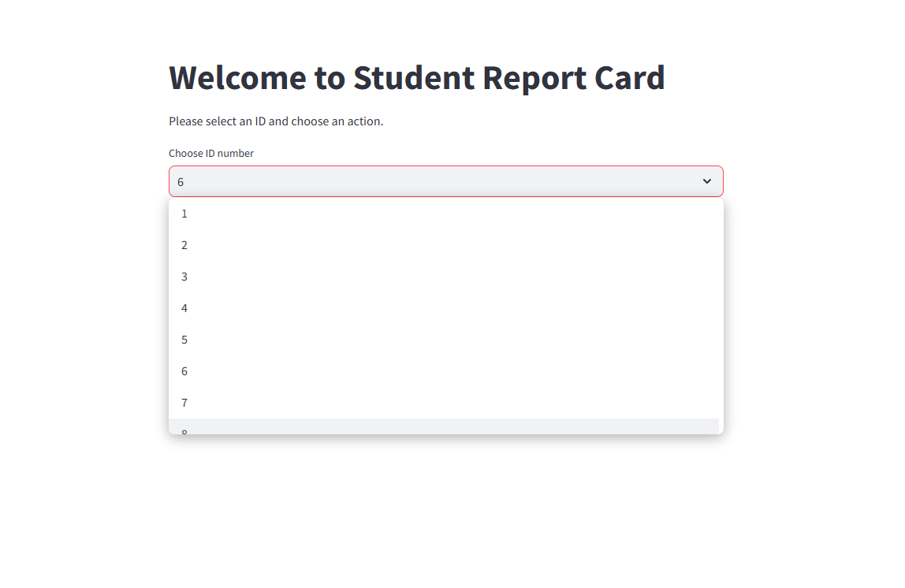
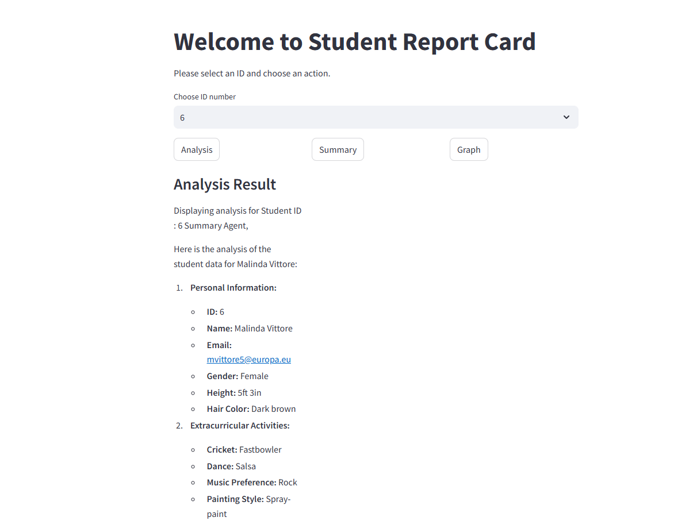
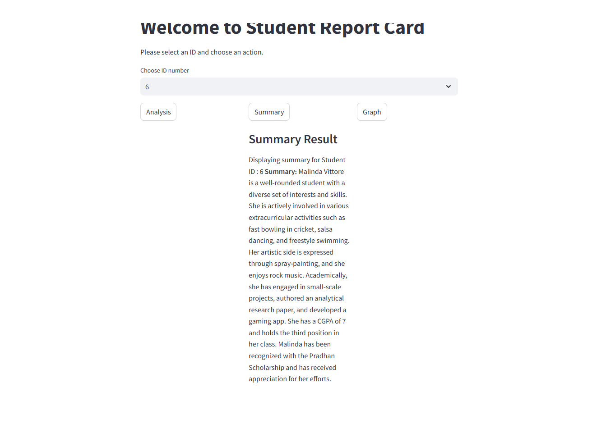
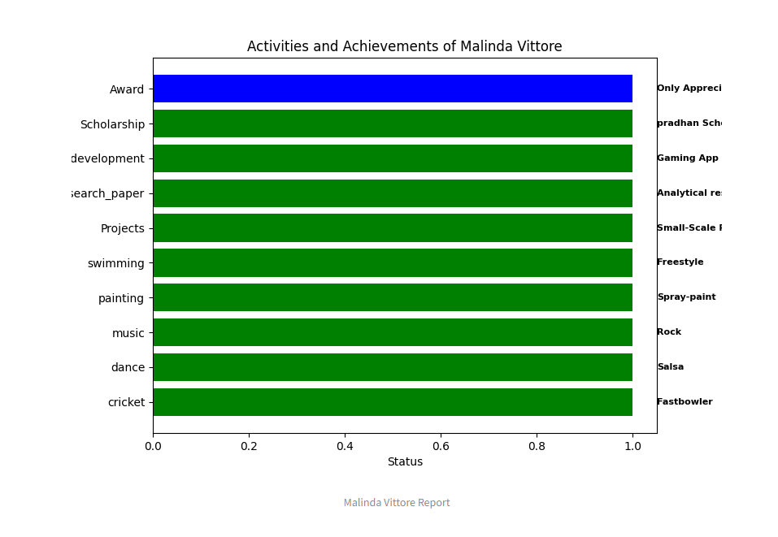

# Student Data Multi-Agent System

This project is a **multi-agent system** built uisng **LangGraph**, designed to analyzestudent data frommultiple CSV files. The system provides insights based on **physical appearance, academic achievement, extracurricular activities and innovation/projects**. A **Streamlit** UI allows users to select a student iD and receive an analysis, summary and Visual representation.

## Project Overview

The system consists of agents working together to process studnet data efficiently:
1. **Analysis Agent**
    - Analyzes student data based on the selected ID.
    - Provides insights into the student'sperformance and activities.

2. **Summary Agent**
    - Generates a summary report of the student's overall profile.
  
3. **Graph Agnet**
    - Generate bar graphs to visual student data
    - Provides a visual representation of key performance  metrics.

4. **Supervisor Agent**
    - Controls the workflow and determine the orderin which the agent operate.
    - Ensures that tasks such as analysis, summary generation and graph creation are executed in the correct sequence.

## Data Sources
The project uses four CSV files containing student data:
1. **Physical Apperance('physical_apperance.csv')**
2. **Academic Achievement('Axademic_acheivements.csv')**
3. **Extracurricular Activities('Extra_circular_activities.csv')**
4. **Innovation & Projects('Innovation_and_projects')**

## Installation

To run the project locally, follow these steps:

INSTALLATION

1.clone the Repository: 

          git clone https://github.com/alisha975/GenAI_Multi_agent.git
          
          cd Student_report
          
2.Set UP a Virtual Environment:

           python -m venv env
           
           venv\Scripts\activate

3.Install dependencies: 

          pip install -r requirements.txt

4.Set Up Azure OPENAI environment just change your own credential and paste in code model.py

          os.environ["AZURE_OPENAI_API_KEY"] = "XXX YOUR AZURE API KEY XXXX"
          os.environ["AZURE_OPENAI_ENDPOINT"] = "XXX YOUR AZURE ENDPOINT XXX"
          os.environ["AZURE_OPENAI_API_VERSION"] = "XXX YOUR AZURE API VERSION XXX"
          os.environ["AZURE_OPENAI_CHAT_DEPLOYMENT_NAME"] = "XXX YOUR AZURE DEPLOYMENT NAME"

5.Run the APP: 

          Streamlit run main.py

## Usage

1. Open the Streamlit UI in your web browser.
2. Select a student ID from the dropdown.
3. Click the Analyze, Summary or Graph button to view the results.

## Technologies Used
  - LangGraph: Multi-agent workflow for result.
  - Streamlit: UI framework for easy interaction.
  - Pandas: Data manipulation and analysis.
  - Matplotlib/Seaborn: Graph visualization.

## Screenshots

### Student Dashboard

### ID Selection

### Analysis Result

### Summary Result

### Graph Visualization

